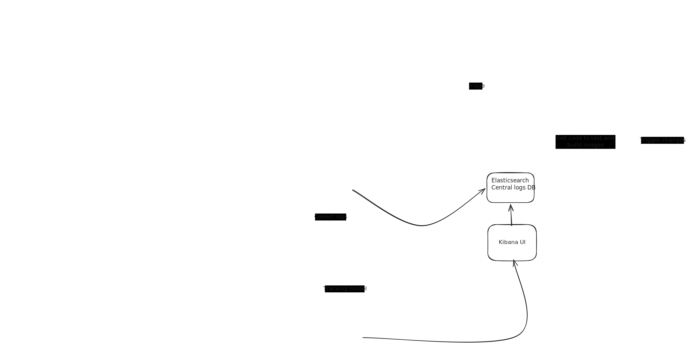

# PhoBERT Medical NER — MLOps Platform

> End-to-end MLOps platform for Vietnamese Medical Named Entity Recognition using PhoBERT, deployed on Google Kubernetes Engine with full CI/CD pipeline.

---

## Table of Contents

- [Repository Structure](#repository-structure)
- [High-Level System Architecture](#high-level-system-architecture)
  - [Infrastructure Overview](#infrastructure-overview)
  - [CI/CD Pipeline](#cicd-pipeline)
  - [Model Serving](#model-serving)
  - [MLOps Stack](#mlops-stack)

---

## Repository Structure

```
.
├── backend
│   ├── app
│   │   ├── api
│   │   │   ├── predict.py
│   │   ├── core
│   │   │   ├── auth.py
│   │   │   ├── config.py
│   │   ├── main.py
│   │   └── services
│   │       ├── kserve.py
│   ├── docker-compose.yaml
│   ├── Dockerfile
│   ├── pytest.ini
│   ├── requirements.txt
│   └── tests
│       └── test_api.py
├── config.yaml
├── data
│   ├── processed
│   │   ├── dataset_dict.json
│   │   ├── label_config.json
│   │   ├── test
│   │   │   ├── data-00000-of-00001.arrow
│   │   │   ├── dataset_info.json
│   │   │   └── state.json
│   │   ├── train
│   │   │   ├── data-00000-of-00001.arrow
│   │   │   ├── dataset_info.json
│   │   │   └── state.json
│   │   └── validation
│   │       ├── data-00000-of-00001.arrow
│   │       ├── dataset_info.json
│   │       └── state.json
│   ├── processed.dvc
│   ├── raw
│   │   ├── dataset_dict.json
│   │   ├── test
│   │   │   ├── cache-3bb03d6dcb48258f.arrow
│   │   │   ├── data-00000-of-00001.arrow
│   │   │   ├── dataset_info.json
│   │   │   └── state.json
│   │   ├── train
│   │   │   ├── cache-57d43ca83aebf9c6.arrow
│   │   │   ├── data-00000-of-00001.arrow
│   │   │   ├── dataset_info.json
│   │   │   └── state.json
│   │   └── validation
│   │       ├── cache-52533c992e9d9bb5.arrow
│   │       ├── data-00000-of-00001.arrow
│   │       ├── dataset_info.json
│   │       └── state.json
│   └── raw.dvc
├── helm
│   └── charts
│       ├── backend
│       │   ├── Chart.yaml
│       │   ├── templates
│       │   │   ├── deployment.yaml
│       │   │   ├── hpa.yaml
│       │   │   ├── ingress.yaml
│       │   │   ├── serviceaccount.yaml
│       │   │   └── service.yaml
│       │   └── values.yaml
│       ├── filebeat
│       │   └── values.yaml
│       ├── minio
│       │   ├── Chart.yaml
│       │   ├── templates
│       │   │   ├── deployment.yaml
│       │   │   ├── _helpers.tpl
│       │   │   ├── pvc.yaml
│       │   │   └── service.yaml
│       │   └── values.yaml
│       ├── mlflow
│       │   ├── Chart.yaml
│       │   ├── templates
│       │   │   ├── deployment.yaml
│       │   │   ├── _helpers.tpl
│       │   │   ├── pvc.yaml
│       │   │   └── service.yaml
│       │   └── values.yaml
│       ├── nginx-gateway
│       │   ├── Chart.yaml
│       │   ├── templates
│       │   │   ├── auth-service.yaml
│       │   │   ├── ingress.yaml
│       │   │   ├── istio-service.yaml
│       │   │   └── secret.yaml
│       │   └── values.yaml
│       └── phobert-inference
│           ├── Chart.yaml
│           ├── templates
│           │   └── inferenceservice.yaml
│           └── values.yaml
├── helmfile.yaml
├── infrastructure
│   ├── main.tf
│   ├── provider.tf
│   ├── terraform.tfstate
│   ├── terraform.tfstate.backup
│   └── variable.tf
├── jenkins
│   ├── custom_image
│   │   ├── docker-compose.yaml
│   │   └── Dockerfile
│   └── terraform
│       ├── main.tf
│       ├── terraform.tfstate
│       └── variable.tf
├── Jenkinsfile
├── notebooks
│   ├── Data_Processing.ipynb
│   ├── EDA.ipynb
│   └── Fintuning.ipynb
├── predictor
│   ├── app
│   │   ├── __init__.py
│   │   ├── model.py
│   ├── coverage.xml
│   ├── Dockerfile
│   ├── pytest.ini
│   ├── requirements.txt
│   └── tests
│       └── test_model.py
├── README.md
├── requirements.txt
└── scripts
    ├── client.py
    ├── download_data.py
    ├── manage_keys.py
    ├── test_gateway.py
    └── tokenize_data.py
```

---

## High-Level System Architecture



### Infrastructure Overview

The platform runs on **Google Cloud Platform** with two main compute resources:

| Component | Resource | Purpose |
|-----------|----------|---------|
| GKE Cluster | `aide1-kserve-cluster` | Runs all services |
| Compute Engine | `jenkins-server` | Hosts Jenkins CI/CD |

The GKE cluster has two node pools:

| Node Pool | Machine | Purpose |
|-----------|---------|---------|
| `system-pool` | e2-standard-4 x2 | Backend, MLflow, MinIO, Monitoring |
| `serving-pool` | e2-standard-4 (autoscale 0→5) | PhoBERT model inference |

---

### CI/CD Pipeline

```
Developer pushes code to GitHub
        │
        ▼
   GitHub Webhook
        │
        ▼
   Jenkins (Compute Engine)
        │
        ├── Stage 1: Test Backend        (python:3.11-slim)
        ├── Stage 2: Test Predictor      (python:3.11-slim)
        ├── Stage 3: Check Coverage      (≥80% required)
        ├── Stage 4: Build Docker Images (docker.sock)
        ├── Stage 5: Push to Docker Hub  (ancaotrinh/*)
        ├── Stage 6: Manual Approval     (production/staging)
        └── Stage 7: Deploy with Helm    (GKE pod agent)
                │
                ├── helm upgrade phobert-backend   → ingress-nginx
                └── helm upgrade phobert-inference → model-serving
```

---

### Model Serving

The PhoBERT model is served via **KServe** on a dedicated node pool with `dedicated=serving:NoSchedule` taint, ensuring model pods are isolated from other workloads.

| Component | Namespace | Description |
|-----------|-----------|-------------|
| KServe InferenceService | `model-serving` | Custom predictor container |
| Autoscaling | min=1, max=3 | Scale based on request concurrency |
| Model Registry | MLflow (`mlops`) | Tracks experiments & model versions |
| Artifact Storage | MinIO (`mlops`) | Stores model weights & artifacts |

---

### MLOps Stack

| Component | Namespace | Access |
|-----------|-----------|--------|
| MLflow | `mlops` | Model tracking & registry |
| MinIO | `mlops` | S3-compatible object storage |
| Elasticsearch | `logging` | Log storage |
| Logstash | `logging` | Log processing & parsing |
| Kibana | `logging` | Log visualization |
| Filebeat | `logging` | Log collection from pods |

